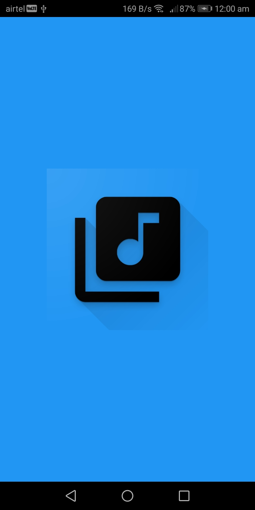
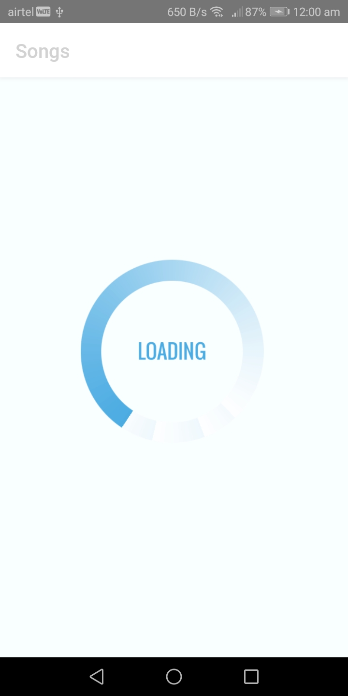
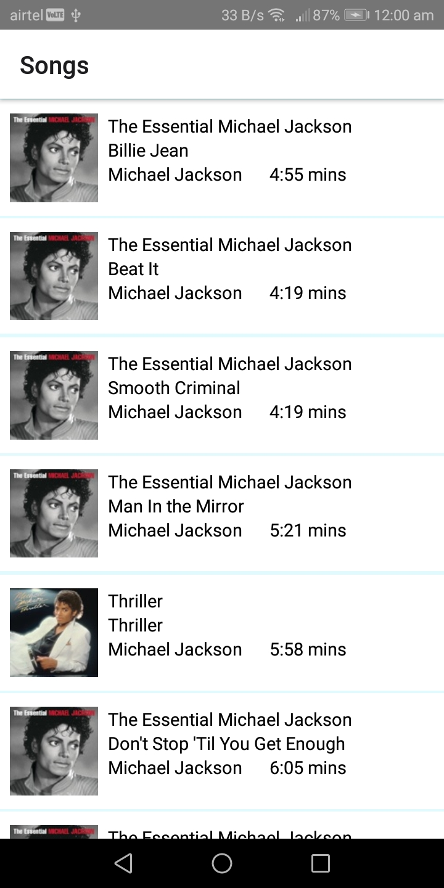
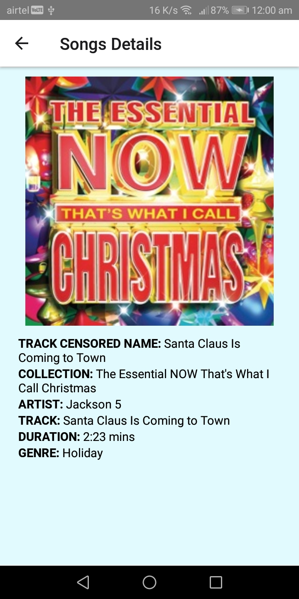

# ReactNativeDemoMusicApp
React Native Demo Music Application

## Project Setup Steps:
1. Please setup the React Environment in your local machine (https://reactnative.dev/docs/environment-setup)
2. Open the project in the terminal then run command "yarn install or npm install".
3. Now you can the run app on android by running command "react-native run-android or yarn run android".

## Screenshots

  
  
  
  

